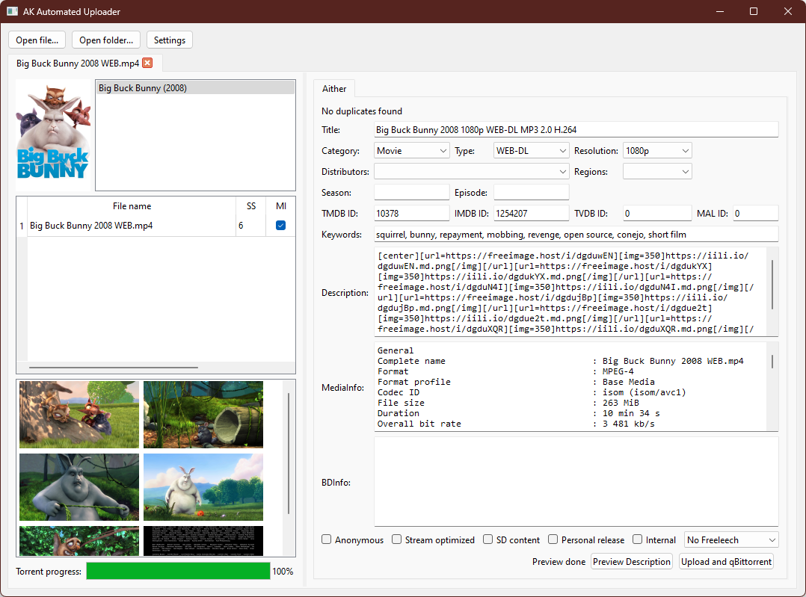

ak-automated-uploader
=====================

A [NodeGui](https://docs.nodegui.org) application for uploading torrents to
Aither (currently) and other trackers (in the future, probably).

Currently pretty barebones, but should work pretty well for most things except
for full discs.

Currently, the only supported image host is Freeimage.host, and the only
supported torrent client is qBittorrent.



Prerequesites
-------------

- A [TMDB API key](https://developer.themoviedb.org/docs/getting-started)
- [ffmpeg and ffprobe](https://www.ffmpeg.org/download.html)

Installation
------------

- Install a recent version of [Node](https://nodejs.org)
- Clone the repository
- Run `npm install`
- Run `npm run build`

Running
-------

- Run `npm run run`

Getting Started
---------------

After you get the app running, open the settings window. If ffmpeg and ffprobe
aren't in your PATH, you can set their locations here. Also don't forget to set
your TMDB API key.

On the other tabs, use the Add button to add a tracker, image host, and torrent
client. The settings window is pretty friendly and shouldn't be too hard to
figure out.

Until I get defaults sorted properly, you'll want to set this as your default
description for Aither under Trackers:

```
{screenshots=350}[url={link}][img={width}]{image}[/img][/url]{/screenshots}
```

Tags
----

Some custom tags, surrounded by curly braces, can be used in descriptions.

- `{screenshots=width}...{/screenshots}`  
  Everything within the `screenshots` tag repeats for each screenshot
- `{link}`  
  Within a screenshots tag, `link` is replaced with a URL for the full size
  screenshot.
- `{image}`  
  Within a screenshots tag, `image` is replaced with a URL for a thumbnail
  image.

The following MediaInfo tags apply to the file with the "MI" checkbox checked:

- `{mediainfo filename}`  
  The base filename (no folder names).
- `{mediainfo fulltext}`  
  The entire MediaInfo text.
- `{mediainfo general/audio/video/text}...{/mediainfo}`  
  Everything within these other `mediainfo` tags are repeated for each
  audio/video/text track.
- `{sep}...{/sep}`  
  Within a `mediainfo` tag, use `sep` to change the separator between each
  track. By default, a line break is used.
- `{SomeTag}`  
  Within a `mediainfo` tag, display a value by using its name directly. You
  can find a list of available tags to use
  [here](https://mediaarea.net/en/MediaInfo/Support/Fields). If the field
  doesn't exist or is empty, the tag won't be displayed and a trailing line
  break will be removed if it exists.
- `{SomeTag} ... {value} ... {/SomeTag}`  
  Within a `mediainfo` tag, display the value for `SomeTag`, but display it
  at your `value` tag. This is useful for doing something like this:
  ```
  {BitRate}Bit rate: {value}{/BitRate}
  ```  
  If the value doesn't exist, the "Bit rate:" label won't be displayed as well.
  Same as with a single tag, if the field doesn't exist or is empty, a trailing
  line break will be removed if it exists.
- `{SomeTag megabits}`  
  Treats the value of `SomeTag` as a number and divides it by 1000000.
- `{SomeTag kilobits}`  
  Treats the value of `SomeTag` as a number and divides it by 1000.
  
Here's an example of these tags together:

```
[b]{mediainfo filename}[/b]

{mediainfo video}Bit rate: {BitRate megabits} mbps
Format: {Format}
Resolution: {Width} x {Height}
Frame rate: {FrameRate} FPS{/mediainfo}

{mediainfo audio}Bit rate: {BitRate kilobits} kbps
Format: {Format}{Format_Commercial_IfAny} ({value}){/Format_Commercial_IfAny}
Channels: {Channels}
{Language}Language: {value}{/Language}{/mediainfo}

Subtitles: {mediainfo text}{sep}, {/sep}{Language}{/mediainfo}
```

- `{field some_field}`
  Use the field tag to use one of the other fields in the form in your
  description. There isn't an easy way at the moment to get a list of available
  fields, but the most pertinent ones for a description on Aither might be
  `name`, `type_id`, `resolution_id`, and maybe `category_id`.
